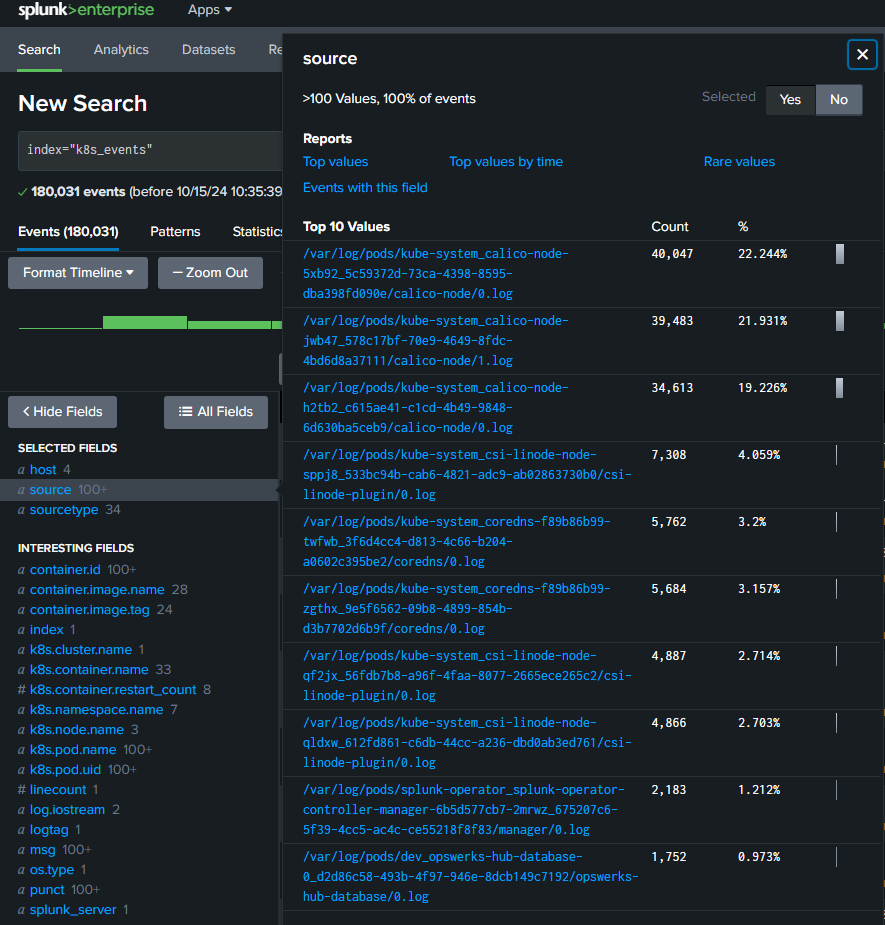
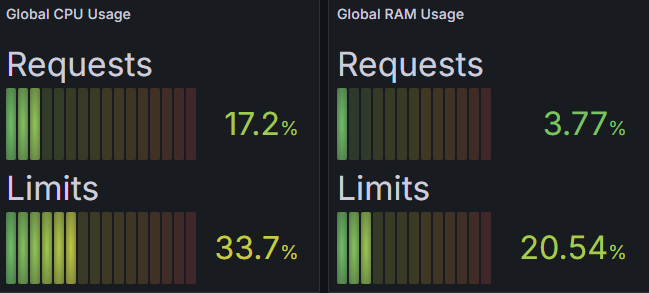

# To ensure that the cluster is running in its most optimal condition follow the tasks below whenever there is a dip in performance or at a scheduled downtime 

## CassandraDB Maintenance

### Regular Tasks
- **Data Backup**: Schedule regular backups of the Cassandra database. Use `nodetool snapshot` for creating snapshots.
- **Repair Operations**: Run `nodetool repair` regularly to maintain data consistency.
- **Monitoring Disk Usage**: Ensure that disk usage does not exceed recommended thresholds.

### Performance Tuning
- Monitor read/write latencies and adjust the configuration accordingly.
- Optimize data modeling based on usage patterns.

### Version Upgrades
- Check the [Cassandra release notes](https://cassandra.apache.org/) for new versions.
- Test upgrades in a staging environment before production rollout.

---

## Monitoring with Splunk

### Configuration
- Ensure Splunk is configured to receive logs from the application and Cassandra. 
- to ensure the splunk is configured to receive logs from the applications run the SplunkQL on the Search bar
```bash
index="k8.metrics"
ensure that all the pods and nodes are visible on the sourece and sourcetype tap on the left side
```

- Create relevant dashboards to monitor application performance and errors.

### Regular Checks
- Review Splunk alerts and logs regularly.
- Adjust log levels as needed to reduce noise while ensuring critical information is captured.

---

## Metrics Monitoring with Prometheus and Grafana

### Configuration
- Ensure Prometheus is scraping metrics from the application and Cassandra.
- Set up Grafana dashboards for visualizing metrics.

### Regular Checks
- Verify that Prometheus is collecting metrics as expected.
- Review Grafana dashboards regularly for anomalies or performance issues.

### Alerts
- Set up alerting rules in Prometheus to notify when metrics exceed thresholds.
- note that Alerts are useless if your phone is on silent. always make sure that you are able to receive alerts from the server

---

## CI/CD with Jenkins

### Pipeline Management
- Regularly review Jenkins pipelines for performance and accuracy.
- Make sure that new changes to the source code must run the unit testing jenkins file in the github repository
- Ensure that all stages of the pipeline are documented and version-controlled.

### Updates
- Keep Jenkins plugins updated to the latest stable versions.
- Monitor Jenkins logs for any build failures or warnings.

### Backup
- Regularly back up Jenkins configuration and job data.

---

## Backup and Recovery Procedures

### Cassandra Backup
- Use `nodetool snapshot` and configure automated scripts to manage backups.
- ensure that you have multiple copies of the backup in both physical and digital format.

### Application Backup
- Ensure application code is version-controlled (e.g., using Git).
- Document any manual backup procedures required for application data.

### Recovery
- Test recovery procedures periodically to ensure they work as intended and the latest version is recovered.

---

## Troubleshooting

### Common Issues
- **Cassandra performance**: Check logs and metrics for slow queries or hardware issues.
- **Monitoring failures**: Ensure that Splunk, Prometheus, and Grafana services are running.

### Resources
- Consult [Cassandra documentation](https://cassandra.apache.org/doc/latest/) for specific errors.
- Use community forums and support channels for Splunk and Jenkins.

---

## Contact Information
For further assistance, please contact:

- **DevOps Team**: datalaketeam@opswerks.com
- **Database Admin**: datalake@opswerks.com
- **Monitoring Team**: datalakemonitor@opswerks.com

---

_Last Updated: 2024-10-16_
